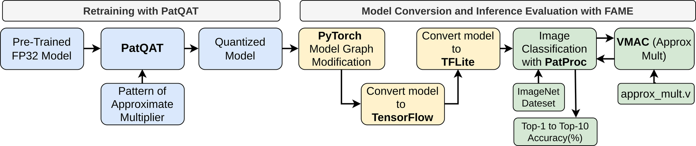

# FAME

An FPGA-Based Platform for Approximate Multipliers Evaluation with Pattern-Guided DNN Retraining



FAME is an FPGA-based platform for evaluating approximate multipliers (AMs) in DNN inference. It pairs hardware-in-the-loop evaluation with **PatQAT**, a pattern-guided quantization-aware retraining method that analyzes the exact/approximate regions of an AM to recover accuracy lost to approximation, without requiring LUT-based emulation of the AM during training. The figure above shows the end-to-end FAME flow together with the PatQAT retraining pipeline.

<h3><span style="color:#0969da"><strong>!! Code will be released Soon !!</strong></span></h3>

## Citation

If you use FAME in your research, please cite:

```bibtex
@inproceedings{saha2026fame,
  title     = {{FAME}: An {FPGA}-Based Platform for Approximate Multipliers Evaluation with Pattern-Guided {DNN} Retraining},
  author    = {Saha, Rappy and Amirafshar, Nima and Haris, Jude and TaheriNejad, Nima and Cano, Jos\'{e}},
  booktitle = {38th IEEE/SBC International Symposium on Computer Architecture and High Performance Computing (SBAC-PAD)},
  year      = {2026}
}
```
